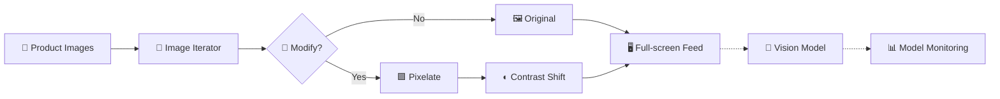
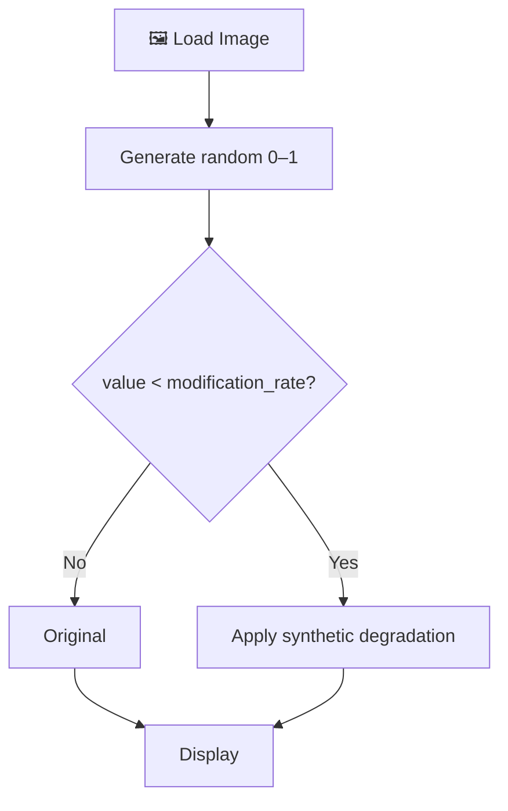
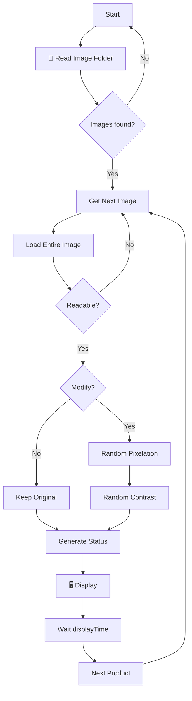

# 📊 Model Monitoring — Conveyor Simulator

### Synthetic visual drift generator for testing Computer Vision model-monitoring workflows

[](https://www.python.org/)
[](https://pillow.readthedocs.io/)
[](https://matplotlib.org/)
[](LICENSE)

**Roni Bandini — Buenos Aires, Argentina — August 2025**

**Model Monitoring — Conveyor Simulator** is a small Python utility for creating a simulated visual production stream from a folder of product images.

Images are displayed continuously in full-screen mode as if they were passing under a camera on an industrial conveyor line.

A configurable percentage of images is randomly modified with:

* 🟪 Pixelation
* ◐ Low contrast
* ◑ Moderate contrast variation
* ◉ Extreme contrast

This makes the script useful for demonstrations and experiments involving:

* Computer Vision monitoring
* input-data drift
* image-quality changes
* production/training skew
* model robustness
* anomaly-detection pipelines

---

## ✨ Features

* 🏭 Simulated conveyor-camera feed
* 🖼️ PNG / JPG / JPEG input
* 🔄 Infinite image loop
* 🎲 Configurable degradation probability
* 🟪 Random pixelation from **2× to 8×**
* ◐ Random contrast perturbation
* 🖥️ Full-screen visualization
* 🏷️ Live original/modified status
* ⚠️ Skips unreadable image files
* 🐍 Single-file Python implementation
* 📦 No ML framework required

---

# 🏗️ Architecture



The repository implements the **left side of this pipeline**: generating a controllable production-like image stream.

The ML model and monitoring system can be connected separately depending on the experiment.

---

# 🎯 Why Simulate Visual Drift?

A Computer Vision model may perform well during development but receive different input distributions after deployment.

For example:

```text
Training images
│
├── Sharp
├── Consistent lighting
├── Good contrast
└── Stable camera
        │
        ▼
     ML Model
        │
        ▼
Production
│
├── Lower resolution
├── Different contrast
├── Camera changes
└── Optical degradation
```

These changes can produce **data drift** even when the object being inspected has not changed.

Model-monitoring systems compare production behavior or data distributions with a reference baseline to detect these changes.

Official background:

👉 **[Google Cloud — Introduction to Model Monitoring](https://docs.cloud.google.com/gemini-enterprise-agent-platform/machine-learning/model-monitoring/overview)**

👉 **[AWS Machine Learning Lens — Monitoring](https://docs.aws.amazon.com/wellarchitected/latest/machine-learning-lens/monitoring.html)**

---

# 🏭 Conveyor Simulation

Main script:

👉 **[`conveyor.py`](https://github.com/ronibandini/modelmonitoring/blob/main/conveyor.py)**

The script scans a directory for:

```text
.png
.jpg
.jpeg
```

using:

```python
image_files = [
    os.path.join(image_folder, f)
    for f in os.listdir(image_folder)
    if f.lower().endswith(
        (".png", ".jpg", ".jpeg")
    )
]
```

The list is converted into an infinite iterator:

```python
image_iterator = cycle(image_files)
```

Once the final image is reached, the simulated conveyor starts again from the beginning.

---

# ⚙️ Configuration

The three principal settings are at the top of the script:

```python
displayTime = 3

modification_rate = 0.1

image_folder = r"C:\Users\XXXX\Desktop\samples"
```

| Setting             | Default | Purpose                               |
| ------------------- | ------: | ------------------------------------- |
| `displayTime`       |     `3` | Seconds each product remains visible  |
| `modification_rate` |   `0.1` | Probability that an image is degraded |
| `image_folder`      |       — | Folder containing source images       |

For example:

```python
modification_rate = 0.1
```

means each image has an independent:

```text
10%
```

probability of being modified.

Other examples:

```python
modification_rate = 0.0   # no modifications
modification_rate = 0.25  # approximately 25%
modification_rate = 0.5   # approximately 50%
modification_rate = 1.0   # modify every image
```

---

# 🎲 Degradation Decision

Each image passes through:

```python
if random.random() < modification_rate:
```

Conceptually:



The degradation is therefore probabilistic rather than applied to a fixed sequence of images.

---

# 🟪 Pixelation

The first transformation reduces the image resolution and then scales it back to its original size.

```python
def pixelate(image, factor):

    small = image.resize(
        (
            max(1, image.width // factor),
            max(1, image.height // factor)
        ),
        Image.NEAREST
    )

    return small.resize(
        image.size,
        Image.NEAREST
    )
```

The factor is randomly selected from:

```python
factor = random.randint(2, 8)
```

giving:

```text
2
3
4
5
6
7
8
```

as possible degradation levels.

Because nearest-neighbor resizing is used in both directions, the resulting image contains clearly enlarged pixel blocks.

---

# ◐ Contrast Modification

After pixelation, contrast is modified with:

```python
ImageEnhance.Contrast(
    degraded
).enhance(
    contrast_factor
)
```

Three contrast ranges are available:

```python
random.uniform(0.0, 0.2)
random.uniform(0.5, 1.8)
random.uniform(3.0, 5.0)
```

Each range is selected randomly.

| Range     | Effect                  |
| --------- | ----------------------- |
| `0.0–0.2` | Extremely low contrast  |
| `0.5–1.8` | Mild/moderate variation |
| `3.0–5.0` | Extreme contrast        |

Pillow defines:

```text
factor = 0   → flat gray
factor = 1   → original contrast
factor > 1   → increased contrast
```

Official reference:

👉 **[Pillow ImageEnhance.Contrast](https://pillow.readthedocs.io/en/latest/reference/ImageEnhance.html)**

---

# 🔬 Synthetic Drift Matrix

A modified image therefore receives two independent visual changes:

```text
Original image
      │
      ▼
Pixelation
factor 2–8
      │
      ▼
Contrast
      │
 ┌────┼──────────┐
 ▼    ▼          ▼
Low   Moderate   Extreme
0-.2  .5-1.8     3-5
```

This can represent simplified production scenarios such as:

| Simulation               | Possible real cause              |
| ------------------------ | -------------------------------- |
| Pixelation               | Resolution / compression change  |
| Low contrast             | Lighting loss / haze             |
| Moderate contrast change | Camera or lighting variation     |
| Extreme contrast         | Exposure / preprocessing problem |

---

# 📺 Full-Screen Visualization

The simulator creates one persistent Matplotlib figure:

```python
fig, ax = plt.subplots(
    figsize=(16, 9)
)
```

Margins and axes are removed:

```python
plt.subplots_adjust(
    left=0,
    bottom=0,
    right=1,
    top=1,
    hspace=0,
    wspace=0
)

ax.axis("off")
```

It then attempts several platform-specific full-screen methods:

```python
mng.full_screen_toggle()
```

with fallbacks to:

```python
mng.window.state("zoomed")
```

and:

```python
mng.window.showMaximized()
```

This allows the image sequence to resemble a live camera monitor rather than a normal plot window.

---

# 🏷️ Image Status

A status label is shown in the upper-left corner.

For an unchanged image:

```text
product001.jpg - original
```

For a modified image:

```text
product001.jpg - modified
(px 4, contrast 0.14)
```

The title is implemented with:

```python
title_text = fig.text(
    0.01,
    0.99,
    "",
    color="white",
    fontsize=14,
    ha="left",
    va="top",
    backgroundcolor="black"
)
```

This makes it possible to visually verify whether each sample belongs to the baseline or synthetic-drift stream.

---

# 🔄 Runtime Flow



Press:

```text
Ctrl + C
```

to stop the conveyor.

The script then closes the Matplotlib window.

---

# 🖼️ Image Error Handling

Pillow loads image contents explicitly:

```python
img = Image.open(img_path)
img.load()
```

If an invalid or corrupted file raises:

```text
OSError
IOError
```

the script reports:

```text
⚠️ Error processing image ...
```

and automatically moves to another image.

This allows a demonstration to continue even if one source file cannot be decoded.

---

# 🧠 Using It in a Model-Monitoring Experiment

A typical experiment can use:

```text
Clean source images
        │
        ▼
conveyor.py
        │
        ├──── 90% unchanged
        │
        └──── 10% degraded
                │
                ▼
          Vision Model
                │
                ▼
      Predictions / Confidence
                │
                ▼
       Monitoring System
```

The simulator can help test questions such as:

* Does confidence fall as image quality degrades?
* Does prediction distribution change?
* Can the monitoring layer distinguish baseline from shifted input?
* How frequently should visual degradation occur before an alert is triggered?
* Which type of image transformation has the largest effect on inference?

The actual inference and drift metric can come from any external model-monitoring stack.

---

# 📊 Model Monitoring Concepts

Production ML monitoring commonly includes several different signals.

### Input / Data Drift

Changes in the distribution of data entering the model.

```text
Training data
     vs.
Production data
```

### Prediction Drift

Changes in the distribution of model outputs.

```text
Previous predictions
        vs.
Current predictions
```

### Model Performance

When ground truth is available:

```text
Prediction
    vs.
Actual label
```

---

# 🚀 Installation

## 1. Clone the Repository

```bash
git clone \
https://github.com/ronibandini/modelmonitoring.git

cd modelmonitoring
```

Repository:

👉 **[github.com/ronibandini/modelmonitoring](https://github.com/ronibandini/modelmonitoring)**

---

## 2. Install Dependencies

```bash
python -m pip install pillow matplotlib
```

Libraries:

👉 **[Pillow](https://pillow.readthedocs.io/)**

👉 **[Matplotlib](https://matplotlib.org/)**

No ML framework is required for the simulator itself.

---

## 3. Prepare Images

Create a folder containing product images:

```text
samples/
├── product001.jpg
├── product002.jpg
├── product003.png
├── product004.jpeg
└── ...
```

---

## 4. Configure the Folder

Windows example:

```python
image_folder = (
    r"C:\Users\Roni\Desktop\samples"
)
```

Linux:

```python
image_folder = (
    "/home/user/samples"
)
```

macOS:

```python
image_folder = (
    "/Users/user/samples"
)
```

---

## 5. Configure the Experiment

For a faster conveyor:

```python
displayTime = 1
```

For 20% synthetic drift:

```python
modification_rate = 0.2
```

For a fully degraded test stream:

```python
modification_rate = 1.0
```

---

## 6. Run

```bash
python conveyor.py
```

The simulator enters its continuous display loop immediately.

Stop with:

```text
Ctrl + C
```

---

# 📁 Repository Structure

```text
modelmonitoring/
│
├── conveyor.py
├── README.md
└── LICENSE
```

* 🏭 **[`conveyor.py`](https://github.com/ronibandini/modelmonitoring/blob/main/conveyor.py)** — visual conveyor simulator
* 📖 **[`README.md`](https://github.com/ronibandini/modelmonitoring/blob/main/README.md)** — original project description
* ⚖️ **[`LICENSE`](https://github.com/ronibandini/modelmonitoring/blob/main/LICENSE)** — MIT License

---

# 🌐 External References

## Google Cloud

Introduction to production model monitoring, input drift, prediction drift and reference datasets:

👉 **[Introduction to Model Monitoring](https://docs.cloud.google.com/gemini-enterprise-agent-platform/machine-learning/model-monitoring/overview)**

---

## Microsoft Azure

Production monitoring signals including data drift, prediction drift, data quality and model performance:

👉 **[Model Monitoring in Azure Machine Learning](https://learn.microsoft.com/en-us/azure/machine-learning/concept-model-monitoring)**

---

## AWS

General ML monitoring lifecycle:

👉 **[AWS Machine Learning Lens — Monitoring](https://docs.aws.amazon.com/wellarchitected/latest/machine-learning-lens/monitoring.html)**

Amazon SageMaker implementation:

👉 **[Amazon SageMaker Model Monitor](https://docs.aws.amazon.com/sagemaker/latest/dg/model-monitor.html)**

---

## Pillow

Image manipulation and contrast processing:

👉 **[Pillow ImageEnhance](https://pillow.readthedocs.io/en/latest/reference/ImageEnhance.html)**

---

## Matplotlib

Python visualization library used for the conveyor display:

👉 **[Matplotlib](https://matplotlib.org/)**

---

# 🔗 Related GitHub Projects

### 👁️ Visual Anomaly

Industrial visual anomaly detection with Edge Impulse FOMO-AD and Texas Instruments TDA4VM.

👉 **[github.com/ronibandini/visualAnomaly](https://github.com/ronibandini/visualAnomaly)**

### ⚙️ Visual Anomaly — Grove Vision AI V2

Automated anomaly detection and physical part rejection using Edge Impulse and Grove Vision AI V2.

👉 **[github.com/ronibandini/visualAnomalyGroveV2](https://github.com/ronibandini/visualAnomalyGroveV2)**

### 🎚️ ML Analog Knob Reading

Computer Vision model for monitoring the position of an analog audio-console control.

👉 **[github.com/ronibandini/MLAnalogKnobReading](https://github.com/ronibandini/MLAnalogKnobReading)**

### 👜 TDA4VM Bag Detector

Computer Vision inference using Edge Impulse and Texas Instruments TDA4VM.

👉 **[github.com/ronibandini/TDA4VM-bag-detector](https://github.com/ronibandini/TDA4VM-bag-detector)**

---

# 📕 Contracultura Maker

**Contracultura Maker** is a book by Roni Bandini about maker culture, experimental electronics, AI, physical computing and technological autonomy.

📂 **[Contracultura Maker — GitHub repository](https://github.com/ronibandini/ContraculturaMaker)**

📕 **[Download Contracultura Maker PDF](https://github.com/ronibandini/ContraculturaMaker/raw/refs/heads/main/ContraculturaMaker2.pdf)**

---

# 📬 Contact

**Roni Bandini**
Maker · AI Developer · Writer
Buenos Aires, Argentina

* 🐙 [GitHub — @ronibandini](https://github.com/ronibandini)
* 🌐 [Medium — @ronibandini](https://bandini.medium.com/)
* 𝕏 [X / Twitter — @RoniBandini](https://x.com/RoniBandini)
* 📸 [Instagram — @ronibandini](https://www.instagram.com/ronibandini/)
* ▶️ [YouTube — @RoniBandini](https://www.youtube.com/@RoniBandini)
* 💼 [LinkedIn — Roni Bandini](https://www.linkedin.com/in/ronibandini/)

---

Built with 🏭 + Python + synthetic drift + Computer Vision.
